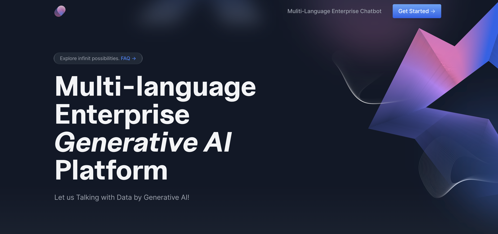

# KYD-AI-ChatBot
"Know your data, quickly talk with you data."

 

### 1.Quick Portral
### 
| **--->** [1. Streamlit](https://rayden-xu-multilingual-intelligent-enterprise-ai-welcome-vz5mt8.streamlit.app/Specialist) |

| **--->** [2. Document](https://docs.google.com/document/d/1QKzW3KQQw7v8-cM_Gu5kstDvxLFp6MEoBYXbJBaexhk/edit?resourcekey=0-tYPhV-aStrxToHWUlHO0kw#) |

| **--->** [3. Codelab](https://codelabs-preview.appspot.com/?file_id=1QKzW3KQQw7v8-cM_Gu5kstDvxLFp6MEoBYXbJBaexhk#0) |

### 2.Architecture

1.Generative AI Demo Core Part:

2.Full Stack MVP Product Part:

### 3.Tech Stacks
- Python
- Streamlit
- Pinecone
- Openai Text-Davinci-003
- Openai Whisper
- AWS S3
- Flask
